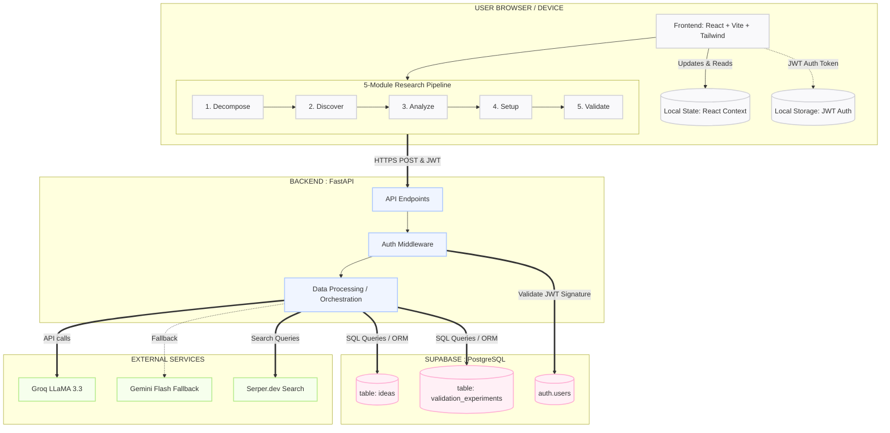

# LaunchLens AI - Monorepo

Complete full-stack startup market research platform with FastAPI backend and React frontend.

## 🏗️ Monorepo Structure

```
launch-lean/
├── backend/
│   ├── app/
│   │   ├── api/                 # Organized route modules (9 endpoints)
│   │   │   ├── decompose.py
│   │   │   ├── discover.py
│   │   │   ├── analyze.py
│   │   │   ├── setup.py
│   │   │   ├── validate.py
│   │   │   ├── ideas.py         # Ideas CRUD + analysis caching
│   │   │   ├── export.py
│   │   │   ├── analysis.py
│   │   │   ├── progress.py
│   │   │   └── router.py        # Centralized router registration
│   │   ├── core/
│   │   │   ├── config.py        # Settings & environment variables
│   │   │   └── auth.py          # Supabase JWT verification
│   │   ├── services/            # Business logic
│   │   │   ├── llm_client.py    # Groq/Gemini fallback
│   │   │   ├── google_search.py # Serper.dev integration
│   │   │   ├── reddit_scraper.py
│   │   │   ├── data_cleaner.py
│   │   │   └── pdf_generator.py
│   │   ├── prompts/
│   │   │   └── templates.py     # LLM system prompts
│   │   ├── schemas/
│   │   │   ├── models.py
│   │   │   └── ideas.py         # Pydantic models for ideas
│   │   └── main.py              # FastAPI application
│   ├── requirements.txt
│   ├── SETUP_DATABASE.sql
│   ├── render.yaml
│   ├── .env.example
│   └── test_*.py
│
├── frontend/
│   ├── src/
│   │   ├── api/                 # Unified API client
│   │   │   ├── client.ts        # Core fetch wrapper
│   │   │   ├── research.ts      # Pipeline endpoints
│   │   │   ├── ideas.ts         # Ideas CRUD + analysis
│   │   │   └── index.ts         # Single re-export point
│   │   ├── components/
│   │   │   ├── layout/          # Nav, Footer, Divider
│   │   │   ├── landing/         # Hero, Story, CTA
│   │   │   ├── discover/        # Discover module
│   │   │   ├── analyze/         # Analyze module
│   │   │   ├── setup/           # Setup/launch planning
│   │   │   ├── validate/        # Validation strategies
│   │   │   ├── common/          # EmptyState
│   │   │   └── ui/              # Shadcn components
│   │   ├── context/             # IdeaContext state
│   │   ├── hooks/               # Custom hooks (research, mobile)
│   │   ├── pages/               # Landing, Research, NotFound
│   │   ├── test/                # Tests & mocks
│   │   │   └── __mocks__/       # Mock data for development
│   │   ├── types/               # TypeScript types
│   │   ├── utils/               # Security & utilities
│   │   ├── lib/                 # Transforms & utilities
│   │   ├── App.tsx
│   │   ├── main.tsx
│   │   └── index.css
│   ├── package.json
│   ├── vite.config.ts
│   ├── tsconfig.json
│   ├── tailwind.config.ts
│   └── .env.local.example
│
├── README.md                    # This file
└── .gitignore
```

## 🏗️ System Architecture



## 🚀 Quick Start

### Backend Setup

```bash
# 1. Install backend dependencies
cd backend
python -m venv venv
source venv/bin/activate  # Windows: venv\Scripts\activate
pip install -r requirements.txt

# 2. Configure environment
cp .env.example .env
# Edit .env with your API keys

# 3. Run server
uvicorn app.main:app --reload --port 8000
# API docs: http://localhost:8000/docs
```

### Frontend Setup

```bash
# 1. Install frontend dependencies
cd frontend
npm install

# 2. Configure environment
cp .env.local.example .env.local
# Update VITE_API_URL if backend is on different port

# 3. Run development server
npm run dev
# App: http://localhost:5173
```

## 🔑 API Keys (All Free Tier)

| Service | Key | Where to Get | Free Tier |
|---------|-----|-------------|-----------|
| **Groq** | `GROQ_API_KEY` | [console.groq.com](https://console.groq.com) | Unlimited requests (~30/min) |
| **Google** | `GEMINI_API_KEY` | [aistudio.google.com](https://aistudio.google.com) | 15 req/min, 1500 req/day |
| **Serper** | `SERPER_API_KEY` | [serper.dev](https://serper.dev) | 2,500 searches/month |
| **Supabase** | `SUPABASE_*` | [supabase.com](https://supabase.com) | 2 free projects |

## 🏛️ Backend Architecture

### API Endpoints

| Endpoint | Method | Purpose |
|----------|--------|---------|
| `/api/decompose-idea` | POST | Parse idea → structured components |
| `/api/discover-insights` | POST | Scan sources → ranked insights |
| `/api/analyze-section` | POST | Generate analysis section |
| `/api/generate-setup` | POST | Launch plan with costs + suppliers |
| `/api/generate-validation` | POST | Validation strategies + landing page |
| `/api/ideas` | POST/GET/PATCH/DELETE | Ideas CRUD operations |
| `/api/analyze-risks` | POST | Risk assessment (cached) |
| `/api/analyze-pricing` | POST | Pricing strategy (cached) |
| `/api/analyze-financials` | POST | Financial projections (cached) |
| `/api/analyze-customer-acquisition` | POST | CAC strategy (cached) |

### LLM Fallback Chain

Every endpoint uses intelligent fallback:
1. **Groq** (LLaMA 3.3 70B) — fastest, primary
2. **Gemini Flash** — if Groq rate-limited
3. **Mock data** — if both fail, frontend uses cached demo data

## 🎨 Frontend Architecture

### Directory Organization

- **api/** - Unified API layer with three modules:
  - `client.ts` - Core fetch wrapper with authentication
  - `research.ts` - Pipeline endpoints (decompose → validate)
  - `ideas.ts` - CRUD + advanced analysis endpoints
  - `index.ts` - Single re-export point for all APIs

- **components/** - React components organized by feature:
  - `layout/` - App shell (Nav, Footer)
  - `landing/` - Public landing page
  - `discover/` - Market research discovery
  - `analyze/` - Opportunity analysis
  - `setup/` - Launch planning
  - `validate/` - Validation strategies
  - `ui/` - Shadcn design system components

- **context/** - IdeaContext for global state management
- **hooks/** - Custom React hooks (useResearchCore, useAnalyzeSection, etc.)
- **pages/** - Page components (Landing, Research, NotFound)
- **test/** - Tests and mock data for development
- **types/** - Centralized TypeScript type definitions
- **utils/** - Security utilities and helpers

## 📦 Deployment

### Backend on Render

```bash
# 1. Push monorepo to GitHub
git push origin main

# 2. Create new Web Service on Render
# - Connect GitHub repo
# - Set root directory: backend/
# - Add environment variables from .env.example
# - Render auto-detects render.yaml configuration

# 3. Service will auto-deploy on push
```

### Frontend on Vercel

```bash
# 1. Deploy to Vercel
cd frontend
npm run build

# 2. In Vercel dashboard:
# - Set build command: npm run build
# - Set output directory: dist
# - Add VITE_API_URL environment variable pointing to your Render backend
```

## 🔄 Development Workflow

### Adding a New Backend Endpoint

1. Create route file in `backend/app/api/`
2. Add Pydantic models in `backend/app/schemas/`
3. Register in `backend/app/api/router.py`
4. Add prompts to `backend/app/prompts/templates.py` if needed

### Adding a New Frontend Feature

1. Create component in `frontend/src/components/`
2. Add API client functions to `frontend/src/api/`
3. Create custom hook in `frontend/src/hooks/` if needed
4. Export types in `frontend/src/types/`

### Running Tests

```bash
# Backend
cd backend
pytest test_backend.py

# Frontend
cd frontend
npm run test
npm run build  # Verify build succeeds
```

## 🛠️ Tech Stack

### Backend
- **Framework:** FastAPI
- **LLM:** Groq (LLaMA) + Google Gemini
- **Search:** Serper.dev + Reddit API
- **Database:** Supabase (PostgreSQL)
- **Auth:** Supabase JWT
- **Server:** Render (free tier)

### Frontend
- **Framework:** React 19 + TypeScript
- **Build:** Vite
- **Styling:** Tailwind CSS + Shadcn UI
- **State:** TanStack Query + Context API
- **Router:** React Router v6
- **Testing:** Vitest + Playwright

## 📝 License

MIT

## 🤝 Contributing

This monorepo follows a clear architecture pattern:
- Each backend route is independent
- Frontend API clients are modular and reusable
- Types are centralized and shared
- No circular dependencies

Please maintain this structure when contributing!
